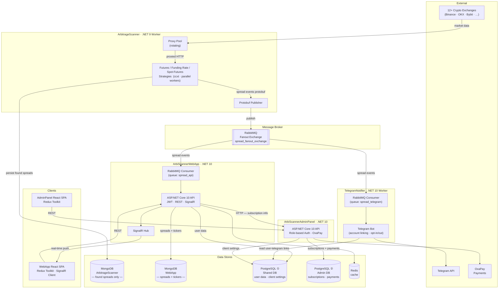

# ArbiScanner

A cryptocurrency arbitrage scanning platform that monitors 12+ exchanges for futures, funding-rate, and spot price spreads in real time. The system is composed of four git submodules wired together with Docker Compose.

---

## Table of Contents

- [Architecture](#architecture)
- [Service Map](#service-map)
- [Repository Structure](#repository-structure)
- [Prerequisites](#prerequisites)
- [Quick Start (Docker)](#quick-start-docker)
- [Environment Variables](#environment-variables)
- [Local Development](#local-development)
- [Git Submodules](#git-submodules)

---

## Architecture



---

## Service Map

| Docker service       | Port(s)       | Purpose                                           | Technology                              |
|----------------------|---------------|---------------------------------------------------|-----------------------------------------|
| `arbitrage-scanner`  | —             | Core arbitrage engine; scans exchanges            | .NET 9, CCXT, RabbitMQ, MongoDB         |
| `web`                | 8080          | User-facing Web API                               | ASP.NET Core 10, PostgreSQL, Redis, MongoDB, SignalR |
| `web-client`         | 80            | User-facing React SPA (spread dashboard)          | React, Vite, nginx                      |
| `admin-api`          | 8081          | Admin Web API (users, subscriptions, payments)    | ASP.NET Core 10, PostgreSQL, Redis      |
| `admin-client`       | 3002          | Admin React SPA                                   | React, Vite, nginx                      |
| `telegram-notifier`  | —             | Sends Telegram spread alerts to subscribers       | .NET 10, RabbitMQ, Telegram.Bot SDK     |
| `postgres`           | 5432          | Relational database (shared + admin schemas)      | PostgreSQL                              |
| `rabbitmq`           | 5672 / 15672  | Message broker; management UI on 15672            | RabbitMQ 3 with management plugin       |
| `redis`              | 6379          | Cache and distributed state                       | Redis                                   |
| `mongodb`            | 27017         | Ticker and spread document store                  | MongoDB                                 |
| `loki`               | 3100          | Log aggregation                                   | Grafana Loki                            |
| `tempo`              | 3200 / 4317 / 4318 | Distributed trace storage (OTLP gRPC/HTTP)   | Grafana Tempo                           |
| `prometheus`         | 9090          | Metrics collection and storage                    | Prometheus                              |
| `grafana`            | 3000          | Observability dashboards                          | Grafana                                 |

---

## Repository Structure

```
ArbiScanner/                          ← monorepo root (this repo)
├── ArbiScanner.slnx                  ← cross-project solution (Rider / Visual Studio)
├── docker-compose.yml                ← orchestrates all services
├── .env                              ← environment variables (not committed)
├── .gitmodules                       ← submodule registry
│
├── ArbiScannerWebApp/                ← submodule: user-facing app
│   ├── ArbiScannerWeb.API/           ← ASP.NET Core 10 Web API
│   ├── ArbiScannerWeb.Abstractions/
│   ├── ArbiScannerWeb.Domain/
│   ├── ArbiScannerWeb.Infrastructure/
│   ├── ArbiScannerWeb.Client/        ← React/Vite SPA
│   ├── Dockerfile                    ← API image
│   ├── Dockerfile.client             ← SPA image
│   └── grafana/                      ← Grafana provisioning config
│
├── ArbiScannerAdminPannel/           ← submodule: admin panel
│   ├── ArbiScannerAdminPanel.API/    ← ASP.NET Core 10 Web API
│   ├── ArbiScannerAdminPanel.Abstractions/
│   ├── ArbiScannerAdminPanel.Application/
│   ├── ArbiScannerAdminPanel.Domain/
│   ├── ArbiScannerAdminPanel.Infrastructure/
│   ├── ArbiScannerAdminPanel.Client/ ← React/Vite SPA
│   ├── Dockerfile
│   └── Dockerfile.client
│
├── ArbiScanner.TelegramNotifierApp/  ← submodule: Telegram notifier worker
│   ├── ArbiScanner.TelegramNotifierApp.Worker/
│   ├── ArbiScanner.TelegramNotifierApp.Application/
│   ├── ArbiScanner.TelegramNotifierApp.Domain/
│   ├── ArbiScanner.TelegramNotifierApp.Abstractions/
│   ├── ArbiScanner.TelegramNotifierApp.Infrastructure/
│   └── Dockerfile
│
└── ArbitrageScanner/                 ← submodule: core scanning engine
    ├── ArbitrageScanner.Worker/      ← .NET 9 hosted service entry point
    ├── ArbitrageScanner.Futures/     ← futures spread scanner
    ├── ArbitrageScanner.Funding/     ← funding-rate scanner
    ├── ArbitrageScanner.Spot/        ← spot price scanner
    ├── ArbitrageScanner.Domain/
    ├── ArbitrageScanner.Infrastructure/
    └── ArbitrageScanner.Worker/Dockerfile
```

---

## Prerequisites

| Tool              | Version  | Required for                              |
|-------------------|----------|-------------------------------------------|
| Docker            | 24+      | All containerised services                |
| Docker Compose    | v2       | Orchestration (`docker compose` command)  |
| .NET SDK          | 10       | ArbiScannerWebApp, AdminPannel, TelegramNotifierApp local dev |
| .NET SDK          | 9        | ArbitrageScanner local dev                |
| Node.js           | 20+      | React/Vite clients local dev              |

---

## Quick Start (Docker)

### 1. Clone the repository with all submodules

```bash
git clone --recurse-submodules https://github.com/dimasdom/ArbiScanner.git
cd ArbiScanner
```

If you already cloned without submodules, initialise them:

```bash
git submodule update --init --recursive
```

### 2. Configure environment variables

Copy the template and fill in the required values:

```bash
cp .env.example .env
# edit .env with your preferred editor
```

At minimum, set the secrets listed in [Environment Variables](#environment-variables) below.

### 3. Build and start all services

```bash
docker compose up --build
```

To run in the background:

```bash
docker compose up --build -d
```

### 4. Verify services

| URL                          | Service                        |
|------------------------------|--------------------------------|
| http://localhost             | User dashboard (React SPA)     |
| http://localhost:8080        | User Web API                   |
| http://localhost:3002        | Admin panel (React SPA)        |
| http://localhost:8081        | Admin Web API                  |
| http://localhost:15672       | RabbitMQ management UI         |
| http://localhost:3000        | Grafana dashboards             |
| http://localhost:9090        | Prometheus metrics UI          |
| http://localhost:3200        | Grafana Tempo query API        |

Default RabbitMQ credentials: `guest / guest`. Set Grafana credentials via `GRAFANA_ADMIN_USER` / `GRAFANA_ADMIN_PASSWORD`.

### 5. Stop services

```bash
docker compose down
```

To also remove persistent volumes:

```bash
docker compose down -v
```

---

## Environment Variables

Create a `.env` file in the repository root. The table below lists every variable consumed by `docker-compose.yml`.

### General / Networking

| Variable            | Description                                      | Example                        |
|---------------------|--------------------------------------------------|--------------------------------|
| `GCP_HOST`          | External IP or domain of the host machine        | `http://192.169.0.1`         |
| `WEB_CLIENT_URL`    | Public URL of the user-facing React SPA          | `http://192.169.0.1`         |
| `ADMIN_CLIENT_URL`  | Public URL of the admin React SPA                | `http://192.169.0.1:3002`    |
| `ADMIN_API_URL`     | Public URL of the admin API (used as Vite build arg) | `http://192.169.0.1:8081` |

### PostgreSQL

| Variable             | Description                                | Example               |
|----------------------|--------------------------------------------|-----------------------|
| `POSTGRES_USER`      | Database superuser name                    | `postgres`            |
| `POSTGRES_PASSWORD`  | Database superuser password                | `changeme`            |
| `POSTGRES_DB`        | Shared main database name                  | `ArbiScannerBot`      |
| `ADMIN_POSTGRES_DB`  | Admin-panel-only database name             | `ArbiScannerAdminPanelDb` |

### MongoDB

| Variable                              | Description                                  |
|---------------------------------------|----------------------------------------------|
| `MONGODB_USERNAME`                    | MongoDB root username                        |
| `MONGODB_PASSWORD`                    | MongoDB root password                        |
| `MONGODB_DATABASE_NAME`               | Target database name                         |
| `MONGODB_CURRENT_SPREADS_COLLECTION`  | Collection name for live spread snapshots    |
| `MONGODB_SPREADS_TICKER_COLLECTION`   | Collection name for historical ticker data   |

### Telegram

| Variable             | Description                              |
|----------------------|------------------------------------------|
| `TELEGRAM_BOT_TOKEN` | Bot token from @BotFather               |

### Monitoring

| Variable                | Description                        | Example                      |
|-------------------------|------------------------------------|------------------------------|
| `GRAFANA_ADMIN_USER`    | Grafana admin username             | `admin`                      |
| `GRAFANA_ADMIN_PASSWORD`| Grafana admin password             | `changeme`                   |
| `LOKI_URI`              | Loki ingest endpoint (internal)    | `http://loki:3100`           |

> **Observability note:** All four .NET services export OpenTelemetry traces to Grafana Tempo via OTLP gRPC (`http://tempo:4317` in Docker, `http://localhost:4317` for local dev). Metrics are scraped by Prometheus from each service's `/metrics` endpoint (web APIs) or a standalone HTTP listener on port 8085 (worker services). The `OpenTelemetry__Endpoint` environment variable in `docker-compose.yml` overrides the default `appsettings.json` value for each service.

### JWT — User Web App

| Variable                           | Description                              |
|------------------------------------|------------------------------------------|
| `JWT_SIGNING_KEY_WEBAPP`           | HMAC signing key (min 32 chars)          |
| `JWT_ISSUER_WEBAPP`                | Token issuer claim                       |
| `JWT_AUDIENCE_WEBAPP`              | Token audience claim                     |
| `JWT_ACCESS_TOKEN_EXPIRATION_MINUTES`  | Access token lifetime in minutes     |
| `JWT_REFRESH_TOKEN_EXPIRATION_DAYS`    | Refresh token lifetime in days       |

### JWT — Admin Panel

| Variable                    | Description                     |
|-----------------------------|---------------------------------|
| `JWT_SIGNING_KEY_ADMINPANEL`| HMAC signing key (min 32 chars) |
| `JWT_ISSUER_ADMINPANEL`     | Token issuer claim              |
| `JWT_AUDIENCE_ADMINPANEL`   | Token audience claim            |

### Seed / Default Accounts

| Variable            | Description                                         |
|---------------------|-----------------------------------------------------|
| `SEED_ENABLED`      | Enable DB seeding on first run (`true` / `false`)   |
| `ADMIN_USERNAME`    | Seeded admin account username                       |
| `ADMIN_PASSWORD`    | Seeded admin account password                       |
| `MANAGER_USERNAME`  | Seeded manager account username                     |
| `MANAGER_PASSWORD`  | Seeded manager account password                     |

### Email (SMTP)

| Variable          | Description                      |
|-------------------|----------------------------------|
| `SMTP_SERVER`     | SMTP hostname                    |
| `SMTP_PORT`       | SMTP port (e.g. `587`)           |
| `SENDER_EMAIL`    | From address                     |
| `SENDER_PASSWORD` | SMTP authentication password     |
| `SENDER_NAME`     | Display name in outgoing emails  |

### OxaPay (Payments)

| Variable                    | Description                                          |
|-----------------------------|------------------------------------------------------|
| `OXAPAY_BASE_URL`           | OxaPay API base URL                                  |
| `OXAPAY_MERCHANT_API_KEY`   | Merchant API key from OxaPay dashboard               |
| `OXAPAY_DEFAULT_CURRENCY`   | Default invoice currency (e.g. `USDT`)               |
| `OXAPAY_DEFAULT_LIFETIME`   | Invoice expiry in minutes                            |
| `OXAPAY_SANDBOX`            | Enable sandbox mode (`true` / `false`)               |

### ArbitrageScanner Engine

| Variable                          | Description                                                        | Example    |
|-----------------------------------|--------------------------------------------------------------------|------------|
| `ARBITRAGE_SPREAD_SIZE`           | Minimum spread percentage to report                                | `0.5`      |
| `ARBITRAGE_POSITION_SIZE`         | Position size used for profitability calculation (USDT)            | `1000`     |
| `ARBITRAGE_KEEP_WATCHING_SPREAD`  | Re-alert threshold percentage for a spread already being watched   | `0.3`      |
| `ARBITRAGE_THREAD_COUNT`          | Number of concurrent scanning threads                              | `8`        |
| `ARBITRAGE_FUNDING_THRESHOLD_RATIO` | Minimum funding-rate ratio to flag                               | `0.01`     |
| `ARBITRAGE_CHAT_ID`               | Telegram chat ID for engine-level alerts                           |            |
| `ARBITRAGE_FUTURES`               | Enable futures spread scanning (`true` / `false`)                  | `true`     |
| `ARBITRAGE_FUNDING`               | Enable funding-rate scanning (`true` / `false`)                    | `true`     |
| `ARBITRAGE_SPOT`                  | Enable spot price scanning (`true` / `false`)                      | `true`     |

---

## Local Development

The `ArbiScanner.slnx` solution file at the repository root can be opened in JetBrains Rider or Visual Studio to navigate all four submodule projects in a single IDE window.

Each submodule also ships its own `.sln` / `.slnx` and `docker-compose.yml` for standalone development.

### Infrastructure (required by all services)

The fastest way to get the dependent services running locally is to start only the infrastructure stack from the root compose file:

```bash
docker compose up postgres rabbitmq redis mongodb -d
```

### ArbiScannerWebApp (ASP.NET Core 10 API + React/Vite)

```bash
cd ArbiScannerWebApp

# Run the API
cd ArbiScannerWeb.API
dotnet run

# In a separate terminal, run the React client
cd ../ArbiScannerWeb.Client
npm install
npm run dev
```

The API listens on `http://localhost:8080` by default. The Vite dev server proxies API calls, so point `VITE_API_URL` at the local API.

### ArbiScannerAdminPannel (ASP.NET Core 10 API + React/Vite)

```bash
cd ArbiScannerAdminPannel

# Run the API
cd ArbiScannerAdminPanel.API
dotnet run

# In a separate terminal, run the React client
cd ../ArbiScannerAdminPanel.Client
npm install
npm run dev
```

The admin API listens on `http://localhost:8081` by default.

### ArbiScanner.TelegramNotifierApp (.NET 10 Worker)

```bash
cd ArbiScanner.TelegramNotifierApp/ArbiScanner.TelegramNotifierApp.Worker
dotnet run
```

Ensure `TELEGRAM_BOT_TOKEN` and RabbitMQ / PostgreSQL connection strings are set in `appsettings.Development.json` or as environment variables.

### ArbitrageScanner (.NET 9 Worker)

```bash
cd ArbitrageScanner/ArbitrageScanner.Worker
dotnet run
```

Requires .NET 9 SDK. Set `MongoDb_ConnectionString` and `RABBITMQ_HOST` in environment or `appsettings.Development.json`. The scanning mode (futures / funding / spot) is controlled via the `Arbitrage__*` environment variables.

> **Note:** In production the `arbitrage-scanner` container is launched with a 4-hour (`14400 s`) timeout via `timeout 14400 dotnet ArbitrageScanner.Worker.dll` and Docker's `restart: unless-stopped` policy to periodically recycle the scanner process.

---

## Git Submodules

This repository uses four git submodules:

| Submodule directory              | Remote repository                                           |
|----------------------------------|-------------------------------------------------------------|
| `ArbiScannerWebApp`              | https://github.com/dimasdom/ArbiScannerWebApp               |
| `ArbiScannerAdminPannel`         | https://github.com/dimasdom/ArbiScannerAdminPannel          |
| `ArbiScanner.TelegramNotifierApp`| https://github.com/dimasdom/ArbiScanner.TelegramNotifierApp |
| `ArbitrageScanner`               | https://github.com/dimasdom/ArbitrageSpreadScanner                |

### Common submodule commands

**Clone including all submodules:**
```bash
git clone --recurse-submodules <repo-url>
```

**Initialise submodules after a plain clone:**
```bash
git submodule update --init --recursive
```

**Pull the latest commit for every submodule:**
```bash
git submodule update --remote --merge
```

**Check the status of all submodules:**
```bash
git submodule status
```

Each submodule is pinned to a specific commit in this repository. After updating a submodule to a new commit, stage and commit the change in the root repo to record the new pin:

```bash
git add ArbiScannerWebApp   # or whichever submodule changed
git commit -m "chore: update ArbiScannerWebApp submodule"
```
