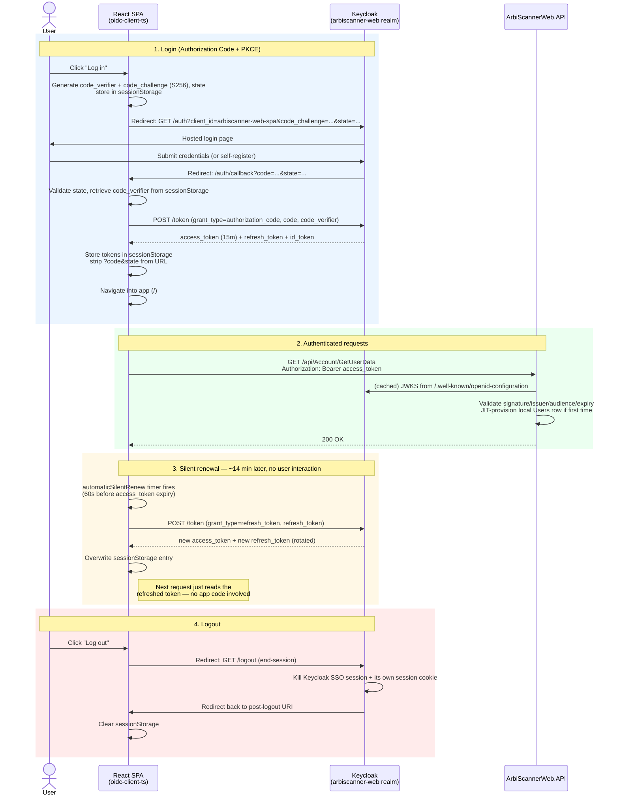

# `ArbiScannerWebApp` — OAuth2/OIDC Authentication Flow

How `ArbiScannerWeb.Client` (React SPA) and `ArbiScannerWeb.API` authenticate users through Keycloak, realm `arbiscanner-web`. See `docs/investigations/oauth-oidc-migration.md` for why this replaced the old self-issued-JWT system.

## Architecture at a glance

| Role | Who plays it |
|---|---|
| Authorization Server / IdP | Keycloak (`auth.arbiscannerwebapp.site`, realm `arbiscanner-web`) |
| Client | `arbiscanner-web-spa` — **public** client, Authorization Code + PKCE (`S256`), no client secret |
| Resource Server | `ArbiScannerWeb.API` — validates tokens, never issues them |
| Token library (browser) | `oidc-client-ts` (protocol/state machine) + `react-oidc-context` (`<AuthProvider>`, `useAuth()`) |

Nothing in this stack sets or reads an httpOnly cookie anymore. Every authenticated request carries `Authorization: Bearer <access_token>` (or, for the SignalR hub, the token as a query-string parameter — see below).

## Where the tokens live

`src/services/oidcUserManager.ts` creates one shared `UserManager`:

```ts
export const oidcUserManager = new UserManager({
    authority: import.meta.env.VITE_OIDC_AUTHORITY,
    client_id: import.meta.env.VITE_OIDC_CLIENT_ID,
    redirect_uri: import.meta.env.VITE_OIDC_REDIRECT_URI,
    response_type: 'code',
    scope: 'openid profile email',
    automaticSilentRenew: true,
    userStore: new WebStorageStateStore({ store: window.sessionStorage }),
});
```

- **`sessionStorage`, not `localStorage`.** The access token, refresh token, ID token, and their metadata live under an `oidc.user:<authority>:<client_id>` key in the tab's session storage. Closing the tab/browser discards them — the user needs `signinRedirect()` again next time (see the SSO-cookie caveat at the end).
- The PKCE `code_verifier` and anti-CSRF `state` are also written to `sessionStorage` by `oidc-client-ts` itself, momentarily, between `signinRedirect()` and the callback being processed.
- No token is ever written to a cookie, `localStorage`, or sent to any first-party backend endpoint for safekeeping — Keycloak is the only party that ever sees the refresh token get exchanged.

## 1. Login

1. User clicks **Log in**. `App.tsx` wires this to `auth.signinRedirect()` (from `useAuth()`).
2. `oidc-client-ts` generates a PKCE `code_verifier` + `code_challenge` (S256) and a random `state`, stashes them in `sessionStorage`, and full-page-navigates the browser to Keycloak's `/protocol/openid-connect/auth` endpoint with `client_id=arbiscanner-web-spa`, `code_challenge`, `state`, and `redirect_uri=.../auth/callback`.
3. Keycloak shows its own hosted login page (this app never sees the password). On success (or on self-registration — `registrationAllowed: true` on this realm), Keycloak redirects the browser to `redirect_uri` with `?code=...&state=...`.
4. `/auth/callback` is a **non-`:lang`-prefixed** route (`AuthCallbackPage.tsx`) — Keycloak's redirect URI has to be one fixed, whitelisted string, incompatible with the app's `/:lang/...` prefixing, so this route lives outside `LangGuard`.
5. `<AuthProvider>` (wrapping the whole app in `main.tsx`) intercepts the `?code=&state=` on mount and calls `oidc-client-ts`'s `signinRedirectCallback()` automatically: it re-derives the PKCE verifier from `sessionStorage`, validates `state`, and **POSTs to Keycloak's token endpoint** (`/protocol/openid-connect/token`, `grant_type=authorization_code`) — this is the actual token issuance step, and it happens browser→Keycloak directly, never touching `ArbiScannerWeb.API`.
6. Keycloak validates the code + PKCE verifier and returns `access_token` (15 min lifetime, `accessTokenLifespan: 900`), `refresh_token`, and `id_token`. `oidc-client-ts` writes all three into `sessionStorage`.
7. `main.tsx`'s `onSigninCallback` strips `?code=&state=` from the URL via `history.replaceState` (so a re-render can't reprocess an already-consumed code).
8. `AuthCallbackPage` watches `auth.isLoading`/`auth.isAuthenticated` and, once true, navigates into the language-prefixed app (`/`).
9. `App.tsx`'s effect (watching `auth.isAuthenticated`) fires `useGetUserDataQuery`, which — via `baseQuery.ts`'s `prepareHeaders` — attaches the fresh access token as `Authorization: Bearer ...` to `GET /api/Account/GetUserData`.

## 2. Every subsequent request

- **REST (RTK Query)**: `baseQuery.ts`'s `prepareHeaders` calls `getAccessToken()` (reads the current user from `oidcUserManager`, returns `user.access_token`) on *every* request and sets the header — there's no caching/interceptor layer, since `oidc-client-ts` already keeps the stored token fresh in the background (see §3).
- **SignalR**: browsers can't set an `Authorization` header on a WebSocket handshake, so `signalrService.ts` passes `accessTokenFactory: () => getAccessToken()`; the client's SignalR SDK appends it as `?access_token=...` on the negotiate/connect requests. The API's `AddJwtBearer` has a matching `OnMessageReceived` handler that only honors that query param for paths under `/hubs`.

## 3. Silent renewal (the actual "refresh" step)

`automaticSilentRenew: true` is what does this — no app code drives it:

1. After tokens are stored, `oidc-client-ts` schedules a timer for **60 seconds before** the access token's `exp` (its default `accessTokenExpiringNotificationTimeInSeconds`) — with a 15-minute access-token lifetime, that's roughly 14 minutes after login.
2. When the timer fires, `oidc-client-ts` calls `signinSilent()` internally.
3. Because Keycloak issued a `refresh_token` alongside the access token (the realm's standard Authorization Code response — no `offline_access` scope needed for this), `signinSilent()` takes the **refresh-token path**: a direct, invisible POST to Keycloak's token endpoint with `grant_type=refresh_token`. No iframe, no redirect, no UI — the tab never navigates.
4. Keycloak validates the refresh token against the user's SSO session (bounded by `ssoSessionIdleTimeout: 1800s` / `ssoSessionMaxLifespan: 36000s`) and returns a **new** `access_token` + **new** `refresh_token` (rotation).
5. `oidc-client-ts` overwrites the `sessionStorage` entry in place. The next `getAccessToken()` call (RTK Query's `prepareHeaders`, or SignalR's `accessTokenFactory`) transparently picks up the new token — nothing in application code needs to react to the renewal.
6. If the refresh itself fails (e.g. the SSO session expired), `oidc-client-ts` fires its `silentRenewError` event and `useAuth().isAuthenticated` flips to `false`; `App.tsx`'s effect dispatches `logout()` on the Redux mirror, and `ProtectedRoute` redirects back to `signinRedirect()` on the next protected navigation.

## 4. Logout

1. User clicks **Log out** → `auth.signoutRedirect()`.
2. Browser is navigated to Keycloak's `/protocol/openid-connect/logout` (end-session) endpoint, which kills the user's Keycloak SSO session and clears Keycloak's own session cookie (on `auth.arbiscannerwebapp.site`, not this app's domain).
3. Keycloak redirects back to the app's configured `post.logout.redirect.uris`.
4. `oidc-client-ts` clears the `sessionStorage` entry as part of the sign-out call — access/refresh/ID tokens are gone from the browser.

## API side: validating the token, not issuing it

`ArbiScannerWeb.Infrastructure/StartupSetup.cs`'s `AddAuthenticationJwt` configures a pure resource-server:

```csharp
options.Authority = jwtOptions.Authority;   // https://auth.arbiscannerwebapp.site/realms/arbiscanner-web
options.Audience = jwtOptions.Audience;     // arbiscanner-web-spa
options.RequireHttpsMetadata = true;
options.MapInboundClaims = false;           // keep short claim names ("sub") as-is
options.TokenValidationParameters = new TokenValidationParameters { NameClaimType = "sub" };
```

- **No signing key is configured anywhere in this app.** `Authority` triggers ASP.NET Core's standard OIDC discovery: it fetches `/.well-known/openid-configuration`, then the `jwks_uri` from that document, caches Keycloak's public signing keys, and validates every inbound token's signature/issuer/audience/expiry against them. Key rotation on Keycloak's side needs no API redeploy.
- `MapInboundClaims = false` matters: without it, ASP.NET Core silently remaps the JWT's short `sub` claim to a long legacy URI before `NameClaimType = "sub"` ever gets a chance to match it — a real bug caught during this migration (see the investigation doc).
- **JIT (just-in-time) provisioning**: `JitUserProvisioningMiddleware` runs immediately after `UseAuthentication()` (front-running both MVC controllers and the SignalR hub's connection requests). On the *first* authenticated request from a given Keycloak `sub`, `JitUserProvisioningService` upserts a local `Users` row (`Id = sub`, `UserName`/`Email` from the `preferred_username`/`email` claims) plus a fresh `UserSettingsModel` — this is what lets the rest of the app (and `ArbiScannerAdminPannel`'s `WebAppUserRepository`, which reads this same table directly) keep working with a normal local user id, without this API ever having provisioned the identity itself.

## Sequence diagram



## Config reference

| Setting | Where | Value (prod) |
|---|---|---|
| `Jwt:Authority` / `Jwt:Audience` | `ArbiScannerWeb.API` appsettings / env | `https://auth.arbiscannerwebapp.site/realms/arbiscanner-web` / `arbiscanner-web-spa` |
| `VITE_OIDC_AUTHORITY` / `VITE_OIDC_CLIENT_ID` / `VITE_OIDC_REDIRECT_URI` | React client build args (`Dockerfile.client`) | same authority, `arbiscanner-web-spa`, `https://www.arbiscannerwebapp.site/auth/callback` |
| Access token lifespan | `keycloak/realm-export/arbiscanner-web-realm.json` → `accessTokenLifespan` | `900` (15 min) |
| SSO session idle / max | same file → `ssoSessionIdleTimeout` / `ssoSessionMaxLifespan` | `1800` / `36000` (30 min / 10 h) |
| PKCE method | `arbiscanner-web-spa` client attributes | `pkce.code.challenge.method: S256` |

## One caveat worth knowing

`sessionStorage` being cleared on tab close does **not** necessarily mean the user has to type their password again. Keycloak sets its own SSO session cookie on `auth.arbiscannerwebapp.site` (separate from anything this app controls). If that cookie is still valid, a fresh `signinRedirect()` in a new tab can complete instantly with no login prompt — Keycloak just redirects straight back with a new code. The user is only forced to re-enter credentials once the Keycloak-side SSO session itself has expired (`ssoSessionIdleTimeout`/`ssoSessionMaxLifespan` above), regardless of what's in the browser tab's `sessionStorage`.
